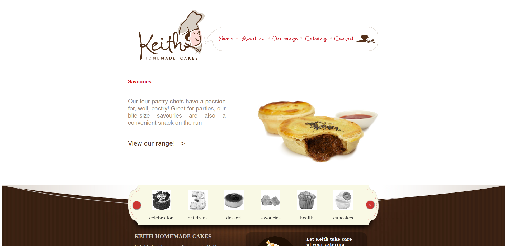

# DevOps Frontend Project

## Overview

This is a frontend application that is containerized using Docker and integrated with Jenkins for Continuous Integration (CI) and Continuous Deployment (CD).

## Usage

- pull image from Docerhub
```
docker pull ahmedashraf15/backehouse:v1
```



